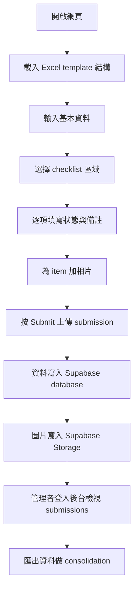

## 1. 產品概述
呢個項目係一個俾現場使用者填寫 checklist 嘅網頁工具，填完之後資料會集中儲存到後台，由你作為管理者統一檢視、篩選同做 consolidation，而唔係由每個使用者各自下載 Excel。
- 主要目的係將原本 Excel checklist 轉成集中式 submission system，減少資料分散、相片散落同人手收集檔案嘅時間。
- 產品價值係前端可以部署到 GitHub Pages，資料同相片則安全存於 Supabase，最後由你喺後台集中管理及匯出。

## 2. 核心功能

### 2.1 功能模組
1. **公開填表頁**: 使用者輸入基本資料、逐個 checklist item 填寫狀態、備註及相片。
2. **提交確認頁**: 顯示提交成功、submission reference，同時可開始新一份檢查。
3. **管理後台頁**: 管理者用 email magic link 登入後台，集中睇 submissions、篩選、預覽相片、匯出資料。

### 2.2 頁面詳情
| 頁面名稱 | 模組名稱 | 功能描述 |
|-----------|-------------|---------------------|
| 公開填表頁 | 基本資料區 | 輸入 ward、inspection date、inspector、handover batch 等 metadata。 |
| 公開填表頁 | 區域切換 | 讀取 Excel template 內 checklist sheet，例如 Ward Office Checklist、Patient Cubicle Checklist。 |
| 公開填表頁 | 項目卡片 | 顯示 Item ID、Category、Element / Feature、Layman Checking Instructions、Target Location。 |
| 公開填表頁 | 狀態與備註 | 每個 item 可選 Pass、Fail、Pending、N/A，並輸入 defect details。 |
| 公開填表頁 | 相片上載 | 每個 item 可加多張相，提交時連同資料上傳到 Supabase Storage。 |
| 公開填表頁 | 提交按鈕 | 將整份檢查作為一個 submission 寫入 database，並生成 reference。 |
| 提交確認頁 | 提交回執 | 顯示 submission ID、完成狀態、返回首頁再開新表單。 |
| 管理後台頁 | Email Magic Link 登入 | 只有指定管理者 email 可以登入後台。 |
| 管理後台頁 | Submission 列表 | 顯示所有 submissions，支援按日期、ward、inspector、status summary 篩選。 |
| 管理後台頁 | Submission 詳情 | 檢視每份 submission 內 item 狀態、備註、相片。 |
| 管理後台頁 | 匯出資料 | 匯出 submissions 做 consolidation，可用 CSV / Excel 格式包含相片連結。 |

## 3. 核心流程
使用者先開啟網頁，系統載入內建 checklist template 並建立一份新 submission。使用者填寫基本資料後，逐個區域完成 item 狀態、備註及相片，最後按 Submit 將資料及圖片集中上傳。你作為管理者之後登入後台，集中瀏覽所有 submission、檢視相片證據，再匯出資料做 consolidation。

## 4. 使用者介面設計
### 4.1 設計風格
- 主色：醫療環境感嘅深藍綠、霧白、柔和灰綠，配合醒目 amber / red 用作警示狀態。
- 按鈕風格：圓角實心按鈕配細緻陰影，主要動作用高對比色，次要動作用 outline。
- 字體：標題採用較有秩序感嘅 serif / humanist display 字體，內文用清晰易讀字體，方便長時間現場操作。
- 版面風格：desktop-first 雙欄工作台；公開填表頁左邊導覽與進度，右邊 item 卡片內容；admin 後台用資料面板式布局。
- 圖示風格：簡潔線性 icon，重視狀態辨識同拍照動作提示。

### 4.2 頁面設計概覽
| 頁面名稱 | 模組名稱 | UI 元素 |
|-----------|-------------|-------------|
| 檢查主頁 | Header | 報告標題、Excel template 名稱、儲存狀態、Export 按鈕。 |
| 檢查主頁 | 基本資料區 | 表單欄位、日期選擇器、dropdown、輸入驗證提示。 |
| 檢查主頁 | 區域導覽 | checklist 區域列表、完成進度條、Fail 項目數 badge。 |
| 項目檢查頁 | 項目卡 | 清晰分段展示 item metadata、instruction、location、status、notes、images。 |
| 項目檢查頁 | 拍照區 | 拖放上載區、相片縮圖、手機相機觸發、圖片數量標籤。 |
| 提交確認頁 | 提交摘要 | 顯示成功訊息、submission reference、重新開始按鈕。 |
| 管理後台頁 | 資料列表 | 表格、filter bar、統計卡片、相片預覽 drawer。 |

### 4.3 響應式
- 採用 desktop-first，優先照顧 office / site notebook 使用情境。
- 平板及手機會轉成單欄模式，區域導覽收疊成 drawer。
- 手機上保留相機輸入優先，按鈕尺寸同相片預覽會針對 touch 操作優化。
