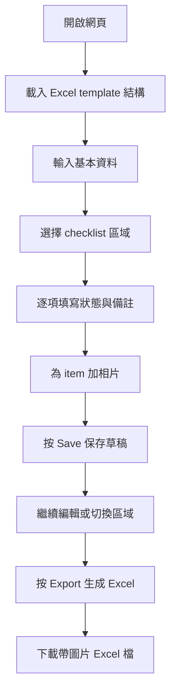

## 1. 產品概述
呢個項目係一個俾現場檢查人員使用嘅網頁表單工具，按現有 `Hospital_Ward_Pre_Handover_Layman_Checklist-(wilson working).xlsx` 結構輸入檢查結果、備註同現場相片，最後一鍵匯出返 Excel 方便你 consolidate。
- 主要目的係將原本 Excel checklist 轉成更易用嘅現場填表介面，減少人手整理照片同抄寫資料嘅時間。
- 產品價值係保留你現有 Excel 工作方式，同時加入拍照記錄、草稿保存同統一輸出格式，方便後續整合及追蹤 defect。

## 2. 核心功能

### 2.1 功能模組
1. **檢查主頁**: 選擇 checklist 區域、輸入基本資料、檢視進度摘要。
2. **項目檢查頁**: 逐個 item 填寫狀態、備註、上載或拍攝相片。
3. **匯出結果頁**: 預覽匯出內容、下載帶圖片 Excel、重置或開始新一份檢查。

### 2.2 頁面詳情
| 頁面名稱 | 模組名稱 | 功能描述 |
|-----------|-------------|---------------------|
| 檢查主頁 | 基本資料區 | 輸入 ward、inspection date、inspector、handover batch 等資料，作為整份報告 metadata。 |
| 檢查主頁 | 區域切換 | 讀取 Excel template 內嘅 checklist sheet，例如 Ward Office Checklist、Patient Cubicle Checklist，俾用戶切換填寫。 |
| 檢查主頁 | 進度摘要 | 即時計算總項目數、Pass/Fail/Pending/N/A 數量、完成百分比。 |
| 項目檢查頁 | 項目卡片 | 顯示 Item ID、Category、Element / Feature、Layman Checking Instructions、Target Location。 |
| 項目檢查頁 | 狀態輸入 | 每個 item 可選 Pass、Fail、Pending、N/A，跟返原 Excel `Settings_Ref` 狀態值。 |
| 項目檢查頁 | 備註輸入 | 可輸入 defect details、補充描述、跟進事項。 |
| 項目檢查頁 | 相片管理 | 每個 item 可加多張相，支援手機拍照、檔案上載、預覽、刪除。 |
| 項目檢查頁 | 草稿保存 | 按 Save 將目前資料同相片暫存在瀏覽器，避免中途關閉頁面導致資料遺失。 |
| 匯出結果頁 | 匯出 Excel | 根據原 template 生成新 Excel，寫入 status、notes、summary，並將 item 相片嵌入對應工作表。 |
| 匯出結果頁 | 匯出命名 | 下載檔名包含 ward / date / timestamp，方便後續整理。 |

## 3. 核心流程
使用者先開啟網頁，系統載入內建 checklist template 並建立一份新檢查。使用者填寫基本資料後，逐個區域完成 item 狀態、備註及相片。按下 Save 時會保存草稿；按下 Export 時會生成一份新 Excel，內容包括原 checklist、填寫結果、summary 同嵌入圖片，方便後續 consolidate。

## 4. 使用者介面設計
### 4.1 設計風格
- 主色：醫療環境感嘅深藍綠、霧白、柔和灰綠，配合醒目 amber / red 用作警示狀態。
- 按鈕風格：圓角實心按鈕配細緻陰影，主要動作用高對比色，次要動作用 outline。
- 字體：標題採用較有秩序感嘅 serif / humanist display 字體，內文用清晰易讀字體，方便長時間現場操作。
- 版面風格：desktop-first 雙欄工作台；左邊導覽與進度，右邊 item 卡片內容。
- 圖示風格：簡潔線性 icon，重視狀態辨識同拍照動作提示。

### 4.2 頁面設計概覽
| 頁面名稱 | 模組名稱 | UI 元素 |
|-----------|-------------|-------------|
| 檢查主頁 | Header | 報告標題、Excel template 名稱、儲存狀態、Export 按鈕。 |
| 檢查主頁 | 基本資料區 | 表單欄位、日期選擇器、dropdown、輸入驗證提示。 |
| 檢查主頁 | 區域導覽 | checklist 區域列表、完成進度條、Fail 項目數 badge。 |
| 項目檢查頁 | 項目卡 | 清晰分段展示 item metadata、instruction、location、status、notes、images。 |
| 項目檢查頁 | 拍照區 | 拖放上載區、相片縮圖、手機相機觸發、圖片數量標籤。 |
| 匯出結果頁 | 匯出摘要 | sheet 完成數據、缺陷統計、匯出成功提示、重新開始按鈕。 |

### 4.3 響應式
- 採用 desktop-first，優先照顧 office / site notebook 使用情境。
- 平板及手機會轉成單欄模式，區域導覽收疊成 drawer。
- 手機上保留相機輸入優先，按鈕尺寸同相片預覽會針對 touch 操作優化。
