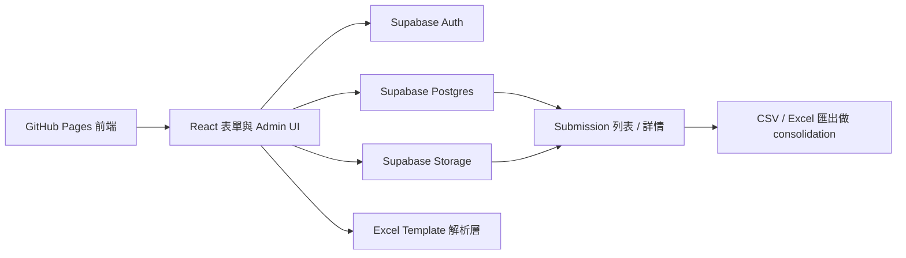

## 1. 架構設計


## 2. 技術說明
- 前端：React 18 + TypeScript + Vite
- UI：Tailwind CSS 3 + 自訂 component 樣式
- BaaS：Supabase（Postgres + Auth + Storage）
- Excel / 匯出：前端保留 template parser；admin 匯出用 `exceljs` / CSV
- 檔案處理：瀏覽器 `File API` + Supabase Storage upload
- 狀態管理：`zustand`
- 草稿儲存：瀏覽器 IndexedDB 作臨時草稿；正式資料以 Supabase 為主
- 初始化工具：Vite
- 部署：GitHub Pages 承載前端，GitHub Actions 自動 build / deploy
- 後端：無自建 server，首版用 Supabase 代替傳統後端

## 3. 路由定義
| 路由 | 用途 |
|-------|---------|
| `/` | 公開填表頁，包含基本資料、區域導覽、檢查項目列表 |
| `/submitted` | 提交成功頁 |
| `/admin` | 管理者後台，顯示 submissions 列表、詳情及匯出 |
| `/admin/login` | Email magic link 登入入口 |

## 4. API / 資料流程
### 4.1 前端與 Supabase 互動
- 公開填表頁提交時先建立 `submissions` 記錄，再批次寫入 `submission_items`。
- 每個 item 相片上傳至 `submission-photos` storage bucket，成功後將 public path / signed path 記錄到 `submission_item_photos`。
- admin 以 Supabase Auth email magic link 登入，登入後讀取 submission 列表及詳細資料。
- 匯出 consolidation 時，前端從 database 拉取資料並整理成 CSV / Excel。

## 5. 核心資料結構
### 4.1 TypeScript 資料模型
```ts
type ChecklistStatus = 'Pass' | 'Fail' | 'N/A';

interface ChecklistTemplateItem {
  id: string;
  sheetName: string;
  category: string;
  element: string;
  instruction: string;
  targetLocation: string;
  rowNumber: number;
}

interface InspectionPhoto {
  id: string;
  name: string;
  mimeType: string;
  dataUrl: string;
  width: number;
  height: number;
  createdAt: string;
}

interface InspectionItemResult {
  itemId: string;
  status: ChecklistStatus | '';
  notes: string;
  photos: InspectionPhoto[];
  updatedAt: string;
}

interface InspectionMeta {
  wardName: string;
  inspectorName: string;
  inspectionDate: string;
  handoverBatch: string;
  remarks: string;
}

interface InspectionDraft {
  templateName: string;
  meta: InspectionMeta;
  results: Record<string, InspectionItemResult>;
}
```

### 5.2 Supabase 資料表
- `admin_users`：可登入後台嘅管理者名單（可選，用 RLS 限制 email）。
- `submissions`：一份 checklist 提交嘅主表，包含 ward、inspector、inspection_date、handover_batch、remarks、submitted_at。
- `submission_items`：每個 item 嘅 status、notes、sheet_name、item_id。
- `submission_item_photos`：每張相片對應 item、storage path、public url、排序。

## 6. 模組拆分
| 模組 | 職責 |
|------|------|
| `template-parser` | 讀取內建 checklist template，轉成前端可渲染嘅 sheet / item 結構 |
| `inspection-store` | 管理 metadata、item result、進度統計、提交流程、草稿保存 |
| `photo-manager` | 處理相片壓縮、縮圖、刪除、提交前上傳準備 |
| `supabase-client` | 包裝 auth、database、storage 互動 |
| `submission-service` | 負責建立 submission、寫 item、上傳圖片 |
| `admin-dashboard` | 顯示 submission 列表、詳情、filter、匯出 |
| `github-pages-workflow` | 自動 build 並 deploy 到 GitHub Pages |

## 7. 介面與驗證規則
- `Submit`：先驗證必填 metadata，再上傳 submission。
- 後台只接受已登入管理者進入。
- 狀態欄必須只接受 `Pass / Fail / N/A`，未選狀態則當作未填。
- 圖片接受 `jpg`、`jpeg`、`png`、`webp`；上傳前會壓縮。
- GitHub Pages build 以 `VITE_SUPABASE_URL`、`VITE_SUPABASE_ANON_KEY`、`VITE_BASE_PATH` 注入。
- item card 以 instruction 區塊作主視覺，notes 與 photo uploader 採 compact layout。

## 8. 風險與處理
- GitHub Pages 只係靜態 hosting：資料收集完全依賴 Supabase，不能只靠 GitHub repo。
- 相片過多會增加 storage / bandwidth：加入圖片壓縮、限制單張大小。
- 前端直接連 Supabase：必須正確設定 RLS，避免公開讀取 admin data。
- GitHub Pages repo path 問題：build 時使用 `VITE_BASE_PATH` 處理路徑前綴。
